# 📡Основы сетей. Часть 1 — «Первый опыт»

## **Содержание**

**Part 1. [Расчет адресов](#part-1-Расчет-адресов)**

**Part 2. [Знакомство с GNS3](#part-2-Знакомство-с-GNS3)**

**Part 3. [Multicast-запросы](#part-3-Multicast-запросы)**

**Part 4. [ARP](#part-4-ARP)**

## 🧮 Part 1. Расчет адресов

### 1. Рассчитать бинарную нотацию для адресов:
 - **178.101.89.7**
 - **201.57.153.161**

***Бинарная (двоичная) нотация IP-адреса*** — это представление каждого октета (числа между точками) в виде 8-битного двоичного числа.

Адрес 178.101.89.7 состоит из четырех октетов:
- Октет 1: 178
- Октет 2: 101
- Октет 3: 89
- Октет 4: 7

*Каждый октет — это число от 0 до 255, которое можно представить 8 битами.*

**Для каждого октета делаем следующее:**
1. Разделяем число на 2 и записываем остаток (0 или 1).
2. Берем целую часть от результата и снова делим на 2, снова записываем остаток.
3. Продолжаем этот процесс, пока целая часть не станет равна 0.
4. Запишем остатки **в обратном порядке.** Это и будет двоичное представление.
5. **Важно:** Дополним результат ведущими нулями до 8 знаков (слева).

#### Пример:
**Октет 1: 178**

178 / 2 = 89, остаток 0

89 / 2  = 44, остаток 1

44 / 2  = 22, остаток 0

22 / 2  = 11, остаток 0

11 / 2  = 5,  остаток 1

5 / 2   = 2,  остаток 1

2 / 2   = 1,  остаток 0

1 / 2   = 0,  остаток 1

Записываем остатки **снизу вверх: 10110010**

Проверяем длину: 8 символов, дополнять нулями не нужно.

**Результат: 10110010**

**Октет 2: 101**
101 / 2 = 50, остаток 1

50 / 2  = 25, остаток 0

25 / 2  = 12, остаток 1

12 / 2  = 6,  остаток 0

6 / 2   = 3,  остаток 0

3 / 2   = 1,  остаток 1

1 / 2   = 0,  остаток 1

Остатки снизу вверх: **1100101**. В этом числе всего 7 бит. Добавляем один ведущий ноль слева, чтобы получилось 8 бит.

**Результат: 01100101**

**Октет 3: 89**

89 / 2 = 44, остаток 1

44 / 2 = 22, остаток 0

22 / 2 = 11, остаток 0

11 / 2 = 5,  остаток 1

5 / 2  = 2,  остаток 1

2 / 2  = 1,  остаток 0

1 / 2  = 0,  остаток 1

Остатки снизу вверх: **1011001**. В этом числе 7 бит. Добавляем один ведущий ноль.

**Результат: 01011001**

**Октет 4: 7**

7 / 2 = 3, остаток 1

3 / 2 = 1, остаток 1

1 / 2 = 0, остаток 1

Остатки снизу вверх: **111**. В этом числе 3 бита. Добавляем пять ведущих нулей.

**Результат: 00000111**

#### Собираем бинарный адрес

Объединяем результаты для каждого октета через точку или пробел.

- `178.101.89.7` в бинарной нотации: `10110010.01100101.01011001.00000111`
- `201.57.153.161` в бинарной нотации: `11001001.00111001.10011001.10100001`

### ***Способ через терминал:***

`echo "obase=2; число" | bc`

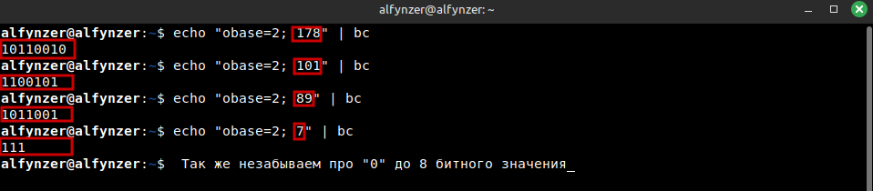

- `obase=2` — устанавливает выходную систему счисления в двоичную (base 2).

- `178` — число для конвертации.

- `bc` — утилита для математических вычислений.

### 2 . Выделить подсети под различные сегменты организации N — технологический (3 машины), серверный (16 машин) и пользовательский (из 32 машин).
_Правило VLSM: выделять подсети нужно от самой большой к самой маленькой. Если начать с маленьких, большие можно "разрезать" и их адреса будут разбросаны по всей сети, создавая пустые "дыры". Это неэффективно. Начиная с больших, мы оставляем непрерывный блок свободного места для мелких подсей._

Воспользуемся утилиткой `ipcalc`  ip адрес возьмем из передыдущего задания `178.101.89.0`

 * **Пользовательский (из 32 машин)**

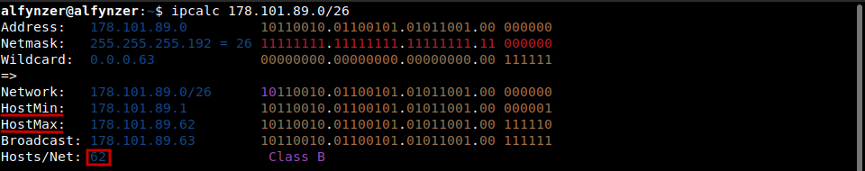

* **Серверный (16 машин)** 

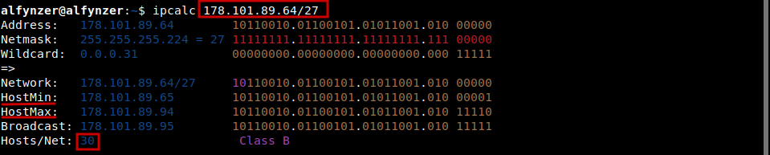

* **Технологический (3 машины)**

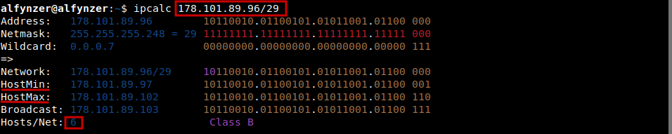

### 3. Сети с какими масками необходимо выделить для каждого из сегментов? Приведи обоснование ответа.

**Общее правило:** В любой IPv4-подсети два адреса всегда зарезервированы и не могут быть назначены устройствам:
- **Адрес сети (Network Address):** Первый адрес в диапазоне.
- **Широковещательный адрес (Broadcast Address):** Последний адрес в диапазоне.

Следовательно, количество доступных IP-адресов для устройств вычисляется по формуле:`Доступные адреса = 2^n - 2`, где `n` — количество бит, отведенных под хостовую часть.

1.  Расчет для технологического сегмента (3 машины)
- **Требуется:** ≥ 3 доступных адреса.
- **Проверяем варианты:**

`Для n=2: 2^2 - 2 = 4 - 2 = 2.` 2 < 3 — НЕДОСТАТОЧНО.

`Для n=3: 2^3 - 2 = 8 - 2 = 6.` 6 >= 3 — ПОДХОДИТ.

- **Вывод:** Требуется 3 бита для хостовой части.
- **Маска подсети:** 32 - 3 = 29 бит.
- **Маска: /29** (в десятичной форме: 255.255.255.248)
- Это минимально возможная подсеть, удовлетворяющая требованию. Выделение 2 бит (2 адреса) недостаточно, так как нужно 3 активных устройства. Выделение 3 бит (6 адресов) является стандартным решением для таких малых сегментов.
2. Расчет для серверного сегмента (16 машин)
- **Требуется:** ≥ 16 доступных адреса.
- **Проверяем варианты:**

`Для n=4: 2^4 - 2 = 16 - 2 = 14.` 14 < 16 — НЕДОСТАТОЧНО.

`Для n=5: 2^5 - 2 = 32 - 2 = 30.` 30 >= 16 — ПОДХОДИТ.

- **Вывод:** Требуется 5 бита для хостовой части.
- **Маска подсети:** 32 - 5 = 27 бит.
- **Маска: /27** (в десятичной форме: 255.255.255.224)
- Выделение 4 бит (14 адресов) недостаточно для 16 серверов. Выделение 5 бит (30 адресов) удовлетворяет требованию и оставляет запас для расширения.
3. Расчет для пользовательского сегмента (32 машины)
- **Требуется:** ≥ 32 доступных адреса.
- **Проверяем варианты:**

`Для n=5: 2^5 - 2 = 32 - 2 = 30.` 30 < 32 — НЕДОСТАТОЧНО.

`Для n=6: 2^6 - 2 = 64 - 2 = 62.` 62 >= 32 — ПОДХОДИТ.

- **Вывод:** Требуется 6 бита для хостовой части.
- **Маска подсети:** 32 - 6 = 26 бит.
- **Маска: /26** (в десятичной форме: 255.255.255.192)
- Выделение 5 бит (что дало бы 30 адресов) не покрывает потребность. Выделение 6 бит (62 адреса) покрывает с запасом, что является корректным и минимально избыточным решением.

## Part 2. Знакомство с GNS3

1. Установлен GNS3 по ссылкам из задания.
2. После установки заданы права для dumpcap: `sudo chmod +x /usr/bin/dumpcap`
3. Импортирован образ Cisco 3745

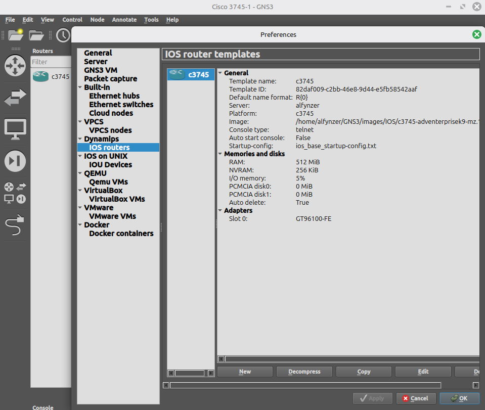

4. Создан проект с одним Router на основе образа Cisco 3745.

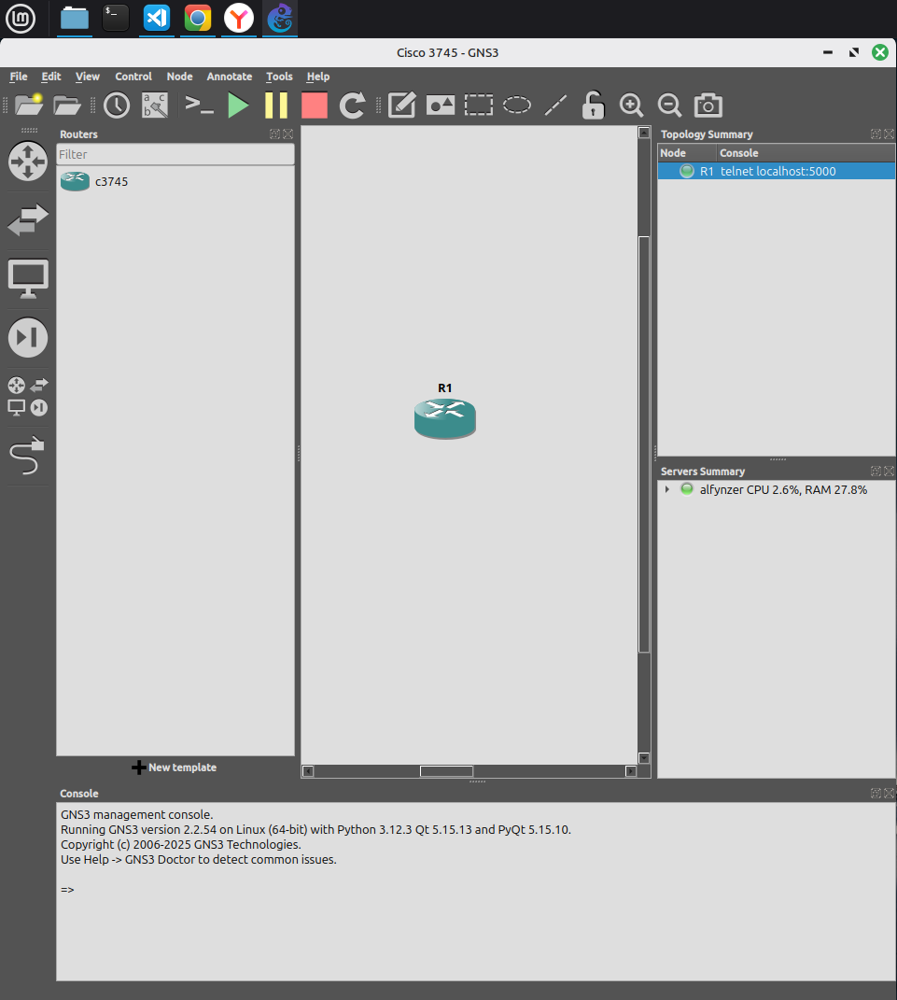

5. Загружено в репозиторий проект в GNS3, на котором размещено импортированное устройство Cisco 3745.

## Part 3. Multicast-запросы

### Задача :
1. Создать проект.
2. Добавить на него два сетевых устройства (используй образ Cisco 3745), соедить их, настроить их сетевые интерфейсы.
3. Запустить эмуляцию и собрать пакетную трассу, обратившись на multicast IP-адрес по ICMP.
4. С помощью Wireshark* изучить результирующий файл трассировки пакетов, обратив внимание на поля, отражающие информацию по L2, L3 и ICMP.
5. Ответить на вопрос: на какой destination MAC-адрес отправляется ICMP-запрос? Ответ записать в текстовый файл с именем multicast.
6. Сохранить результирующий файл собранной трассировки пакетов в файл с расширением .pcap с именем multicast

--- 
### 1-2. 
1. Создаем новый проект `Multicast.gns3`
2. Перетаскиваем с образа Cisco 3745  в проект два роутера (рекомендуется на каждом запустить `idle-pc`)

    _— это специальный параметр, который Dynamips использует для снижения загрузки CPU при эмуляции маршрутизатора._
- _Снижает нагрузку на CPU с 90–100% до 1–5%_
- _Позволяет запускать несколько маршрутизаторов одновременно_
- _Делает работу с GNS3 / Dynamips стабильнее и быстрее_

2. 1  Соединяем их интерфейсами FastEthernet0/0 и запускаем

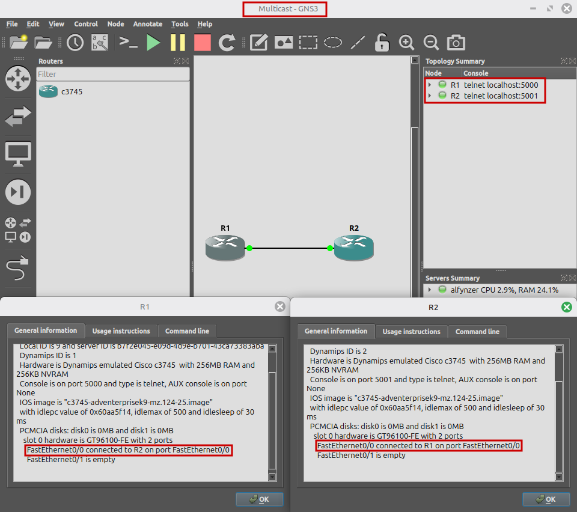

2. 2 Настраиваем их сетевые интерфейсы ( по рекомендации берем простые ip 10.10.10.1/24 и 10.10.10.2/24) _10.10.10.0/24 нельзя назначать т.к. он зарезервирован_
- R1 заходим ЛКМ🖱️ `console`

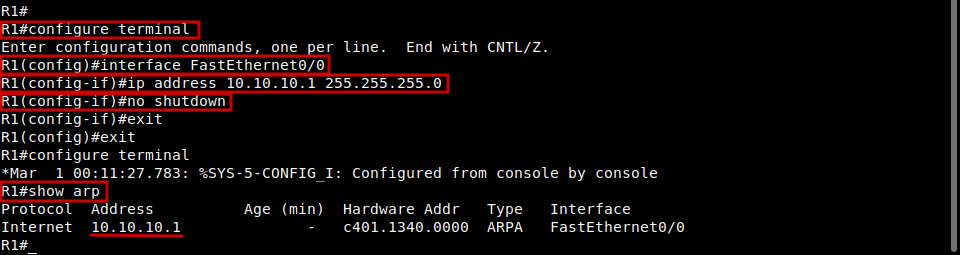

**Важно: сохраняем настройки перед выходом R1# `copy running-config startup-config`**
- R2 заходим ЛКМ🖱️ `console`

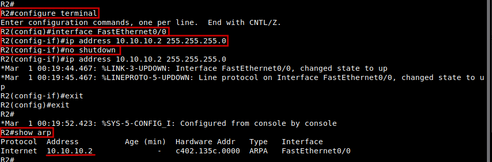

**Настройка multicast-группы (важно!)** 

_Чтобы устройство отвечало на multicast, добавьте интерфейс в multicast-группу._

**На R2 (который будет отвечать):**

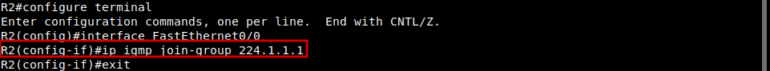

-Проверяем что R2 присвоилась группа multicast

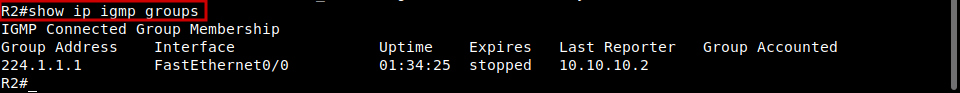

**Важно: сохраняем настройки перед выходом R1# `copy running-config startup-config`**

### 3. 
-  Запустить эмуляцию 
- Щёлкаем правой кнопкой по линку между R1 и R2.
- Выбераем "Start capture".
- В появившемся окне выбераем Wireshark как анализатор
- Начнётся захват трафика.
- Отправка ICMP-запроса на multicast-адрес (в консоле R1 `ping 224.1.1.1`)

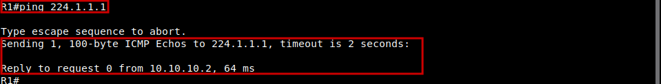

### 4.
- Информация по L2, L3 и ICMP 
- Уровень L2 — Data Link (Канальный уровень)
- Уровень L3 — Network (Сетевой уровень)

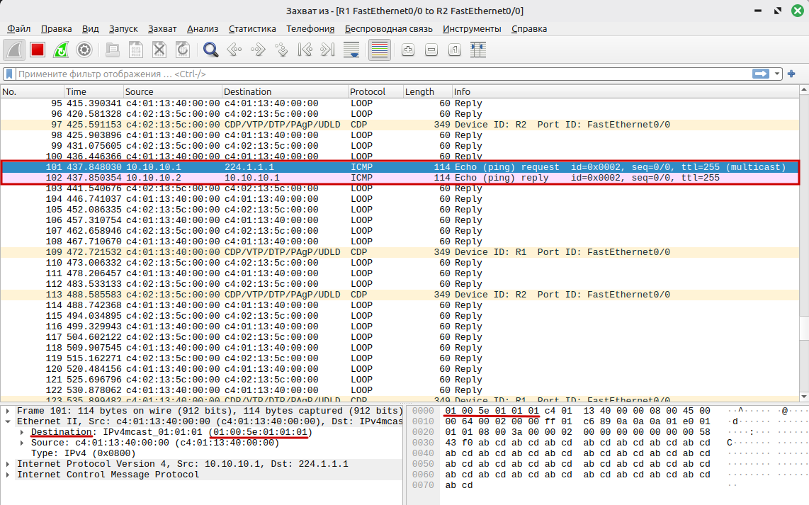

### 5. 
- MAC-адрес формируется по принципу 01:00:5e:XX:XX:XX (XX:XX:XX — это последние 23 бита от IP multicast-адреса.)
- ICMP-запрос отправляется на 01:00:5e:00:01:01 
- 01:00:5e - стандартный префикс 
- 00:01:01 - многоадресный адрес с обнулённым первым битом

***Ответ: Destination MAC-адрес: 01:00:5E:01:01:0***  - записан в файле multicast.txt

### 6. 
- Останавливаем захват в Wireshark.
- Сохраняем файл как multicast.pcap

## Part 4. ARP

### 1. Запустть сбор трассировки пакетов, выполнить с одного из узлов команду ping до ip соседнего устройства. Убедитесь, что после этого в ARP таблице присутствует соответствующая ARP-запись

- Создаем 2 роутера, настраиваем их по аналогии с предыдущим заданием

**R1**

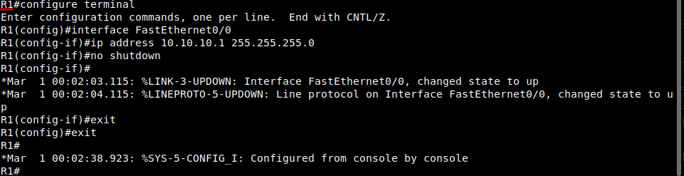

**Важно: сохраняем настройки перед выходом R1# `copy running-config startup-config`**

**R2**

**Важно: сохраняем настройки перед выходом R1# `copy running-config startup-config`** 

- Щёлкаем правой кнопкой по линку между R1 и R2.
- Выбераем "Start Capture" → в качестве анализатора укажите Wireshark. (начнётся запись трафика в реальном времени.)
- Выполнение ping и проверка ARP-таблицы на R1 `ping 10.10.10.2`
### 2. В Wireshark ознакомимся с содержимым ARP- и ICMP-пакетов.

- После успешного пинга проверяем ARP-таблицу:

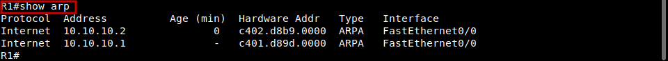

_Это означает, что R1 узнал MAC-адрес R2._
### 3. На какой MAC адрес в первом ARP пакете отправляется запрос? Как называется данный адрес? Ответы запишем в текстовый файл с именем arp.

- В первом ARP пакете запрос отправляется на MAC адрес ff:ff:ff:ff:ff:ff
- Это адрес Broadcast - широковещательный адрес  255.255.255.225.
- Ответный пакет исходит от MAC-адреса c4:01:d8:9d:00:00 (Это MAC-адресc того устройства, которого пинг)

*Сохраним это в arp.txt*
### 4. Обратить внимание, от какого MAC-адреса исходит ответный пакет. Сохранить результирующий файл .pcap Wireshark с именем arp.
- Ответный пакет исходит от MAC-адреса c4:01:d8:9d:00:00 (Это MAC-адресc того устройства, которого пинг)
- Сохранен фаил arp.pcap
- Сохраняем arp.gns3